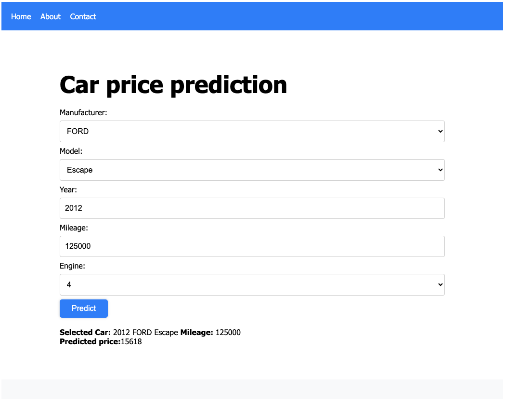

# Car Price Prediction App
This is a simple app to show how to create a complete solution that uses a machine learning model for prediction. 



## Project Structure
```
root
 +-data: contains the training data.
 |
 +-fronend: frontend application by Angular
 |
 +-model: backend predictor model in python and Flask API.
 
```

## How to Run

### Use Docker

### Manual
